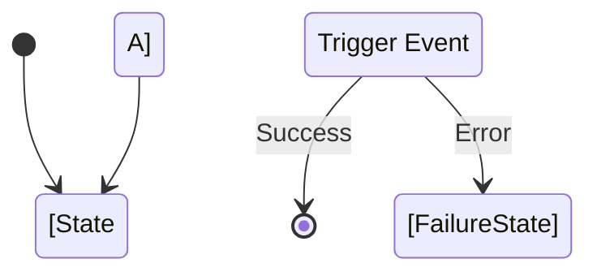

# {{ Workflow Name }} Workflow

## 1. Trigger
[What business event initiates this workflow?]

## 2. Actors
[Who or what system executes this workflow?]

## 3. Workflow Logic Visual

## 4. Sequence of Operations
[Step-by-step narrative of the entity state changes across the database]
1. -> [Action A]
2. -> [Action B]

## 5. Affected Entities
[List of tables/categories updated during this workflow]

## 6. Failure & Compensation Logic
[What happens if it fails midway? Transactions? Manual repair?]

### Manual Repair Procedures
In case of catastrophic failure, use the `__tx_id` to identify and repair partial updates:
- **Search Query**: `SELECT * FROM table WHERE __tx_id = 'failed_tx_uuid';`
- **Reversion Strategy**: [Describe how to revert or complete the operation manually]

## 7. Performance & Latency
Estimate the volume of operations per workflow execution.

- **Inserts per run**: [Estimated Number]
- **Updates per run**: [Estimated Number]
- **Expected Latency Target**: [e.g., <200ms]
- **Batching Strategy**: [Describe if batching is used]
