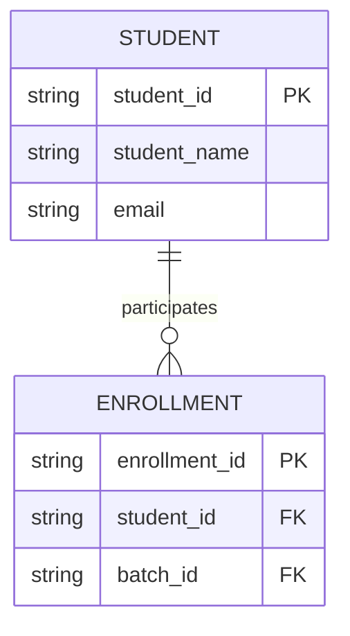

# Mermaid ER-Diagram Prompt Guidelines

When acting as the Diagram Generator, your job is to translate the structural and semantic model into Mermaid.js `erDiagram` syntax.

**Constraints:**
1. Always use the `erDiagram` keyword at the start.
2. Use cardinality markers correctly:
   - `one to one`: `||--||`
   - `one to many`: `||--o{`
   - `zero to many`: `|o--o{`
   - `many to many`: `}|--|{`
3. Include primary keys (PK) and foreign keys (FK) in the entity definitions.
4. Include data types (string, number, date, etc.).

**Example Structure:**

**Workflow:**
1. Identify all entities in the current context (Category or Table).
2. Extract all relationships from the `relations` metadata in the schema.
3. Map internal types to generic types (e.g., `enum` -> `string`).
4. Generate the final Mermaid code block.
