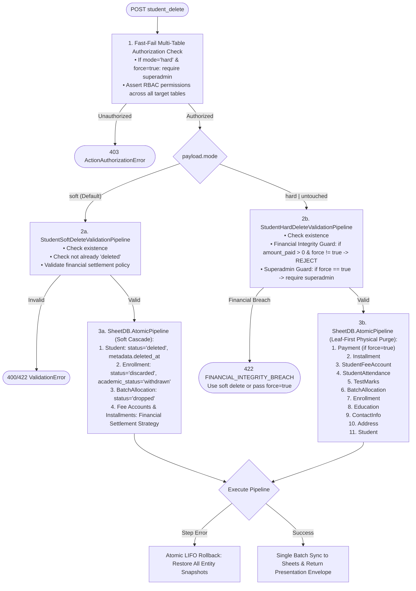

# API Action Specification: `student_delete` (Unified Soft & Hard Deletion)

> **Document Status**: Production Spec  
> **Schema Version**: `2.2.0`  
> **Target Subsystem**: `Student Lifecycle & Identity Management`  
> **Controller Implementation**: [DazzlingDB/DBServices/ConcreteActions.js](DazzlingDB/DBServices/ConcreteActions.js) -> `DeleteStudentAction`, `DeleteUntouchedStudentAction`  
> **Service Implementation**: [DazzlingDB/DBServices/StudentService.js](DazzlingDB/DBServices/StudentService.js) -> `StudentService.softDeleteStudent`, `StudentService.hardDeleteStudent`  
> **Validation Pipelines**: 
> - [DazzlingDB/Validate/StudentSoftDeleteValidationPipeline.js](DazzlingDB/Validate/StudentSoftDeleteValidationPipeline.js) -> `StudentSoftDeleteRules`  
> - [DazzlingDB/Validate/StudentHardDeleteValidationPipeline.js](DazzlingDB/Validate/StudentHardDeleteValidationPipeline.js) -> `StudentHardDeleteRules`  
> **Test Suites**: 
> - [DazzlingDB/Test/Student_SoftDeleteTests.js](DazzlingDB/Test/Student_SoftDeleteTests.js)  
> - [DazzlingDB/Test/Student_HardDeleteTests.js](DazzlingDB/Test/Student_HardDeleteTests.js)  
> - [DazzlingDB/Test/Student_DeleteUntouchedTests.js](DazzlingDB/Test/Student_DeleteUntouchedTests.js)

---

## 0. 6-Phase Compliance Audit Matrix

| Specification Phase | Verification Standard | Status |
| :--- | :--- | :--- |
| **Phase 1: Action Classification** | Action keys, RBAC roles, target tables, and dual execution modes defined. | PASSED |
| **Phase 2: Relational Boundaries** | Foreign keys, RESTRICT/CASCADE rules, and leaf-first topological purge order specified. | PASSED |
| **Phase 3: Data Contracts** | All `payload.*` parameters cataloged with types, requirements, enums, and constraints. | PASSED |
| **Phase 4: Payload Envelopes** | Canonical Request JSON, `200 OK` Success Envelopes (soft & hard), and Error JSON provided. | PASSED |
| **Phase 5: Transaction Mechanics** | `SheetDB.AtomicPipeline` LIFO rollback safety and comprehensive error registry cataloged. | PASSED |
| **Phase 6: Math & Accounting** | LaTeX formulations included for financial settlement policies and ledger balancing. | PASSED |

---

## 1. Action Metadata Matrix

| Metadata Field | Execution Attribute / Constraint |
| :--- | :--- |
| **Action Key** | `student_delete` (Primary) <br> `student_delete_untouched` (Backward-Compatible Alias) |
| **HTTP Dispatch Method** | `POST` (Routed via `ApiDispatcher.dispatch`) |
| **Supported Modes** | 1. `mode: "soft"` (Default): Cascading soft-deletion with audit trail preservation.<br>2. `mode: "untouched"`: Safe hard deletion for zero-activity records.<br>3. `mode: "hard"`: Permanent physical purge across all 10 downstream tables. |
| **RBAC Access Privileges** | `admin` \| `superadmin`<br>*(Note: `mode: "hard"` with `force: true` strictly requires `superadmin` role).* |
| **Controller Type** | Specialized Domain Action Controller (`DeleteStudentAction`, `DeleteUntouchedStudentAction`) |
| **Target Gateway Tables (Soft Delete)** | Primary: `Student` <br> Cascaded Children: `Enrollment`, `BatchAllocation`, `StudentFeeAccount`, `Installment` <br> Preserved Audit Tables: `Address`, `ContactInfo`, `Education`, `Attendance`, `Marks` |
| **Target Gateway Tables (Hard Delete)** | Full 10-Table Purge: `Payment` $\to$ `Installment` $\to$ `StudentFeeAccount` $\to$ `StudentAttendance` $\to$ `TestMarks` $\to$ `BatchAllocation` $\to$ `Enrollment` $\to$ `Education` $\to$ `ContactInfo` $\to$ `Address` $\to$ `Student` |
| **Execution Performance Target** | $O(1)$ Single-Pass RAM Array Write per table step (`< 250 ms`) |
| **Transaction Boundary** | `SheetDB.AtomicPipeline` with transactional state rollback guarantee |

---

## 2. Architectural Axioms & Relational Boundaries

### 2.1 Unified Deletion Architecture Flowchart



---

### 2.2 Soft Deletion Strategy (`mode: "soft"`)
* **Identity Soft-State**: Updates primary `Student` status to `"deleted"`. Preserves the row in the sheet, updating `metadata.deleted_at` and `metadata.deleted_reason`.
* **Audit Trail Preservation**: Historical graphs (`Address`, `ContactInfo`, `Education`, `Attendance`, `Marks`) are **retained** in persistent storage for institutional compliance and historical reporting.
* **Academic Contract Cascade**: All linked active/suspended `Enrollment` contracts transition to `status: "discarded"` and `academic_status: "withdrawn"`.
* **Operational Seating Release**: All active `BatchAllocation` records transition to `status: "dropped"`, immediately freeing up physical batch seating capacity.
* **Declarative Financial Settlement**: Reuses the centralized `FinancialSettlementStrategyRegistry` to balance linked fee accounts:
  - `waive_unpaid` (Default): Caps final fee to collected amount ($F_{\text{final}} = A_{\text{paid}}$) and waives remaining unpaid installments ($B_{\text{due}} = 0$).
  - `settle_liability`: Sets liability requirement ($F_{\text{final}} = R_{\text{required}}$) and recalculates balance due.
  - `refund` / `prorated_refund`: Records refund liability against collected fees.
  - `retain_ledger`: Freezes accounts in their current state without ledger adjustments.

---

### 2.3 Hard Deletion Strategy (`mode: "hard"` & `mode: "untouched"`)
* **Permanent Physical Purge**: Completely removes the student entity and all foreign key references from spreadsheet storage across 10 tables.
* **Leaf-First Topological Deletion Sequence**: Deletions execute in strict reverse-dependency order to eliminate orphan references:
  $$\text{Payment} \to \text{Installment} \to \text{StudentFeeAccount} \to \text{StudentAttendance} \to \text{TestMarks} \to \text{BatchAllocation} \to \text{Enrollment} \to \text{Education} \to \text{ContactInfo} \to \text{Address} \to \text{Student}$$
* **Financial Protection Guard (`force: false`)**:
  - If a student has collected payments (`amount_paid > 0` or existing `Payment` rows), hard deletion is **blocked** with `FINANCIAL_INTEGRITY_BREACH`.
  - The API instructs the client to use soft deletion (`mode: "soft"`) or request a `superadmin` force purge (`force: true`).
* **Superadmin Force Hard Delete (`force: true`)**:
  - Allows permanent purging of accounts with financial history (e.g. testing cleanup or compliance right-to-be-forgotten purges).
  - Explicitly requires `superadmin` role privileges. Standard `admin` callers attempting `force: true` are rejected with `403 ActionAuthorizationError`.
* **Backward-Compatible Untouched Alias (`student_delete_untouched`)**:
  - Delegates to `StudentService.hardDeleteStudent({ ...payload, mode: "hard", force: false }, context)`.
  - Guarantees zero downtime or breaking changes for existing client integrations.

---

## 3. Parameter Validation Dictionary

All parameters must be encapsulated within the root `payload` container.

### 3.1 Root Protocol Request Parameters

| Attribute | Type | Required? | Validation Rules & Constraints |
| :--- | :--- | :--- | :--- |
| `action` | `string` | **Yes** | Must evaluate strictly to `"student_delete"` or `"student_delete_untouched"`. |
| `token` | `string` | **Yes** | Active session token resolved via `AuthBridge`. |
| `payload` | `object` | **Yes** | Container object holding deletion parameters. |

### 3.2 Payload Domain Contract (`payload.*`)

| Parameter Path | Type | Required? | Enums / Constraints | Strategy Applicability | Business Description |
| :--- | :--- | :--- | :--- | :--- | :--- |
| `payload.student_id` | `string` | **Yes** | Pattern: `^STU-[A-Z0-9]+$` | All Modes | Target student primary key identifier. |
| `payload.mode` | `string` | No | Enum: `["soft", "untouched", "hard"]` <br> Default: `"soft"` | All Modes | Deletion strategy mode. |
| `payload.force` | `boolean` | No | Default: `false` | Hard Delete Only | If `true`, permits hard deletion of accounts with collected payments (requires `superadmin`). |
| `payload.reason` | `string` | No | Max Length: 500 | Soft Delete Only | Human-readable administrative reason for soft deletion. |
| `payload.financial_settlement` | `object` | No | Valid JSON Object | Soft Delete Only | Optional financial settlement configuration. |
| `payload.financial_settlement.policy` | `string` | No | Enum: `["waive_unpaid", "settle_liability", "refund", "prorated_refund", "retain_ledger"]` <br> Default: `"waive_unpaid"` | Soft Delete Only | Declarative fee account settlement policy. |
| `payload.financial_settlement.required_amount` | `number` | Required for `settle_liability` | Non-negative numeric (`>= 0`) | Soft Delete Only | Required liability settlement amount. |
| `payload.financial_settlement.refund_amount` | `number` | Optional for `refund` | Non-negative numeric (`0 <= refund_amount <= amount_paid`) | Soft Delete Only | Target amount to refund to the student. |
| `payload.financial_settlement.remarks` | `string` | No | Max Length: 255 | Soft Delete Only | Settlement audit remarks. |

---

## 4. API Request & Response Payload Envelopes

### 4.1 Canonical Request Envelopes

#### Scenario A: Soft Deletion (`mode: "soft"`)
```json
{
  "action": "student_delete",
  "token": "USR_SESSION_TOKEN_STRING_12345",
  "payload": {
    "student_id": "STU-002002",
    "mode": "soft",
    "reason": "Student relocated to another city; requested complete account withdrawal.",
    "financial_settlement": {
      "policy": "waive_unpaid",
      "remarks": "Admin waived remaining fee installments on student account soft-delete"
    }
  }
}
```

#### Scenario B: Untouched / Standard Hard Deletion (`mode: "hard"`, `force: false`)
```json
{
  "action": "student_delete",
  "token": "USR_SESSION_TOKEN_STRING_12345",
  "payload": {
    "student_id": "STU-002002",
    "mode": "hard",
    "force": false
  }
}
```

#### Scenario C: Superadmin Force Hard Deletion (`mode: "hard"`, `force: true`)
```json
{
  "action": "student_delete",
  "token": "SUPERADMIN_SESSION_TOKEN_99999",
  "payload": {
    "student_id": "STU-001001",
    "mode": "hard",
    "force": true
  }
}
```

---

### 4.2 Standard `200 OK` Success Envelopes

#### Soft Delete Response (`mode: "soft"`)
```json
{
  "success": true,
  "action": "student_delete",
  "data": {
    "student_id": "STU-002002",
    "student_name": "Bob Smith",
    "status": "deleted",
    "deleted_at": "2026-08-16T17:14:19.000Z",
    "cascaded_counts": {
      "enrollments": 1,
      "allocations": 1,
      "fee_accounts": 1,
      "installments": 2
    },
    "financial_settlement_policy": "waive_unpaid"
  },
  "message": "Successfully soft-deleted Student 'STU-002002'.",
  "context": {
    "executionTimeMs": 84,
    "mutatedRecordsCount": 5,
    "mutationManifest": [
      "Student",
      "Enrollment",
      "BatchAllocation",
      "StudentFeeAccount",
      "Installment"
    ]
  },
  "meta": {
    "environment": "TESTING",
    "version": "2.2.0",
    "timestamp": "2026-08-16T17:14:19.120Z"
  }
}
```

#### Hard Delete Response (`mode: "hard"`)
```json
{
  "success": true,
  "action": "student_delete",
  "data": {
    "student_id": "STU-002002",
    "student_name": "Bob Smith",
    "mode": "hard",
    "forced": false,
    "purged_counts": {
      "payments": 0,
      "installments": 2,
      "fee_accounts": 1,
      "attendance_records": 0,
      "test_marks": 0,
      "allocations": 1,
      "enrollments": 1,
      "education_records": 1,
      "contact_records": 1,
      "address_records": 1,
      "students": 1
    }
  },
  "message": "Successfully hard-deleted Student 'STU-002002'.",
  "context": {
    "executionTimeMs": 142,
    "mutatedRecordsCount": 8,
    "mutationManifest": [
      "Installment",
      "StudentFeeAccount",
      "BatchAllocation",
      "Enrollment",
      "Education",
      "ContactInfo",
      "Address",
      "Student"
    ]
  },
  "meta": {
    "environment": "TESTING",
    "version": "2.2.0",
    "timestamp": "2026-08-16T17:14:20.050Z"
  }
}
```

---

### 4.3 Standard Error Response Envelopes

#### Error 1: Financial Integrity Breach on Hard Delete (`422 Unprocessable Entity`)
```json
{
  "success": false,
  "action": "student_delete",
  "error": {
    "type": "ValidationError",
    "errorCode": "FINANCIAL_INTEGRITY_BREACH",
    "message": "Financial Integrity Guard: Student [STU-001001] has collected fee payments (amount_paid = ₹2,000). Hard deletion blocked to prevent revenue ledger disparity. Use soft delete ('mode: soft') or supply 'force: true' with superadmin authorization.",
    "details": [
      {
        "field": "student_id",
        "message": "Cannot hard delete student with collected payments."
      }
    ]
  },
  "context": {
    "executionTimeMs": 18,
    "mutatedRecordsCount": 0
  },
  "meta": {
    "environment": "TESTING",
    "version": "2.2.0",
    "timestamp": "2026-08-16T17:14:20.100Z"
  }
}
```

#### Error 2: Superadmin Force Privilege Missing (`403 Forbidden`)
```json
{
  "success": false,
  "action": "student_delete",
  "error": {
    "type": "ActionAuthorizationError",
    "errorCode": "FORBIDDEN_ACCESS",
    "message": "Access denied: Force hard-deletion requires 'superadmin' privileges.",
    "details": []
  },
  "context": {
    "executionTimeMs": 6,
    "mutatedRecordsCount": 0
  },
  "meta": {
    "environment": "TESTING",
    "version": "2.2.0",
    "timestamp": "2026-08-16T17:14:20.150Z"
  }
}
```

---

## 5. Transaction Mechanics & Error Code Registry

### 5.1 `SheetDB.AtomicPipeline` Multi-Step Execution & LIFO Rollback
1. **Pre-Flight Validation Engine**: Executes without modifying sheets. Rejects invalid payloads or unauthorized force attempts with zero database writes.
2. **Topological Step Assembly**:
   - Soft Delete registers status update steps across 4 tables.
   - Hard Delete registers leaf-first physical removal steps across up to 10 tables.
3. **LIFO Snapshot Rollback Guarantee**: If any step encounters an unexpected runtime error (e.g. spreadsheet write timeout or quota breach), `AtomicPipeline` executes a strict Last-In, First-Out (LIFO) rollback, restoring all previous tables to their exact in-memory pre-execution state.
4. **RAM-to-Sheet Batch Synchronization**: Persists all table modifications in exactly $1$ locked array write per table.

### 5.2 Error Code Registry

| Error Code | HTTP Status | Trigger Condition | Mitigation & Recovery |
| :--- | :--- | :--- | :--- |
| `ACTION_VALIDATION_FAILURE` | `400 Bad Request` | Missing `payload` or `student_id` in request envelope. | Provide valid non-empty `student_id` string. |
| `FORBIDDEN_ACCESS` | `403 Forbidden` | User lacks RBAC permissions for any cascaded table, or non-superadmin passes `force: true`. | Elevate caller role or ensure caller has table permissions via `AuthBridge`. |
| `STUDENT_NOT_FOUND` | `404 Not Found` | `student_id` does not match any record in `Student` table. | Verify target student identifier prior to dispatching deletion. |
| `STUDENT_ALREADY_DELETED` | `422 Unprocessable` | Target student is already in `status === 'deleted'` when requesting soft delete. | Soft deletion is idempotent-guarded; do not re-delete soft-deleted records. |
| `FINANCIAL_INTEGRITY_BREACH` | `422 Unprocessable` | Hard delete requested on student with `amount_paid > 0` and `force != true`. | Use `mode: "soft"` to preserve financial ledgers, or pass `force: true` with `superadmin` role. |
| `INVALID_FINANCIAL_SETTLEMENT` | `422 Unprocessable` | Unknown `policy` or missing `required_amount` for `settle_liability`. | Pass a supported settlement policy with required numeric parameters. |
| `REFUND_EXCEEDS_PAID` | `422 Unprocessable` | `refund_amount` exceeds cumulative `amount_paid` on fee account. | Ensure refund amount does not exceed collected payments ($A_{\text{refund}} \le A_{\text{paid}}$). |

---

## 6. Mathematical Ledger & Accounting Formulations

When performing soft deletion, financial settlements are governed by formal accounting balancing formulations to guarantee zero ledger disparity:

### 6.1 `waive_unpaid` Policy
Calculates the final adjusted fee by capping it strictly to accumulated collections:

$$\Delta_{\text{waived}} = F_{\text{final, orig}} - A_{\text{paid}}$$

$$F_{\text{final, new}} = A_{\text{paid}}$$

$$B_{\text{due, new}} = F_{\text{final, new}} - A_{\text{paid}} = 0$$

For each individual installment $k \in \{1, \dots, N\}$:
$$I_{\text{due}, k, \text{new}} = I_{\text{paid}, k}$$
$$I_{\text{status}, k} = \begin{cases} \text{"paid"}, & \text{if } I_{\text{paid}, k} > 0 \\ \text{"waived"}, & \text{if } I_{\text{paid}, k} = 0 \end{cases}$$

### 6.2 `settle_liability` Policy
When a student has incurred usage liability (e.g. attended classes prior to withdrawal without full payment):

$$F_{\text{final, new}} = R_{\text{required}}$$

$$B_{\text{due, new}} = \max\left(0, R_{\text{required}} - A_{\text{paid}}\right)$$

If $A_{\text{paid}} \ge R_{\text{required}}$, the account is marked paid with surplus refund balance:
$$S_{\text{refund}} = A_{\text{paid}} - R_{\text{required}}$$

---

## 7. Comparative Summary: Soft vs. Hard Deletion

| Architectural Dimension | Soft Deletion (`mode: "soft"`) | Hard Deletion (`mode: "hard"`, `force: false`) | Force Hard Deletion (`mode: "hard"`, `force: true`) |
| :--- | :--- | :--- | :--- |
| **Primary Intent** | Student withdrawal, relocation, or lifecycle exit. | Pruning zero-activity duplicates or test records. | Compliance right-to-be-forgotten or test purge. |
| **Required Role** | `admin` \| `superadmin` | `admin` \| `superadmin` | `superadmin` ONLY |
| **Student Table Impact** | `status: "deleted"`, `metadata.deleted_at` set. | Row physically purged. | Row physically purged. |
| **Enrollment & Seating** | `discarded`/`withdrawn`, allocations `dropped`. | Rows physically purged. | Rows physically purged. |
| **Financial Ledger** | Balanced via `FinancialSettlementStrategyRegistry`. | Rows physically purged (if unpaid). | Rows & payment receipts physically purged. |
| **Payment History** | **Strictly Preserved** | **Must be Zero** (or blocked) | Permanently deleted. |
| **Audit History (Address, Contact, Edu, Attendance)** | **Strictly Preserved** | Rows physically purged. | Rows physically purged. |
| **Reversibility** | Reversible by administrative status restoration. | **Irreversible** | **Irreversible** |
